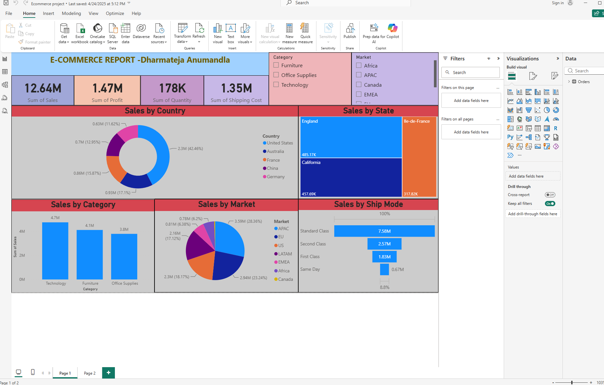

# E-Commerce-PowerBI-Dashboard
# E-Commerce Power BI Dashboard

An interactive E-Commerce Sales Dashboard created using Microsoft Power BI.

## 📊 Dashboard Overview

This dashboard provides an analysis of E-Commerce sales performance across different countries, states, categories, markets, and shipping modes.

## 📌 Key Metrics

| Metric | Value |
|---|---:|
| Total Sales | 12.64M |
| Total Profit | 1.47M |
| Total Quantity | 178K |
| Total Shipping Cost | 1.35M |

## 📈 Analysis Included

- Sales by Country
- Sales by State
- Sales by Category
- Sales by Market
- Sales by Ship Mode
- Sales and Profit KPIs
- Interactive Category filters
- Interactive Market filters

## 🛠️ Tools Used

- Microsoft Power BI
- Power Query
- DAX
- Data Visualization

## 🖼️ Dashboard Preview

       

## 📁 Files

- [📊 Power BI Report (.pbix)](E-Commerce-PowerBI-Dashboard.pbix)
- [🖼️ Dashboard Screenshot](ecommerce-dashboard.png)

